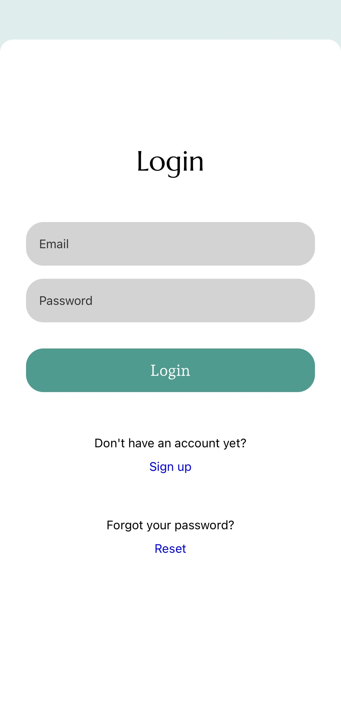
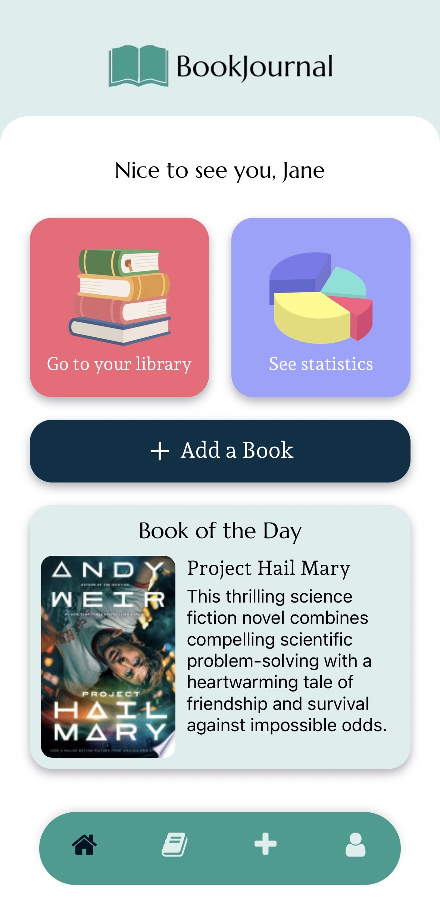
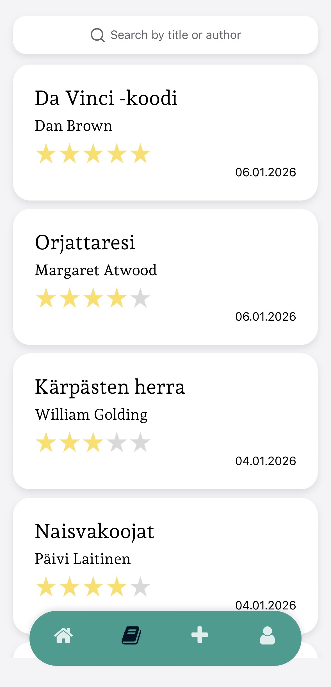
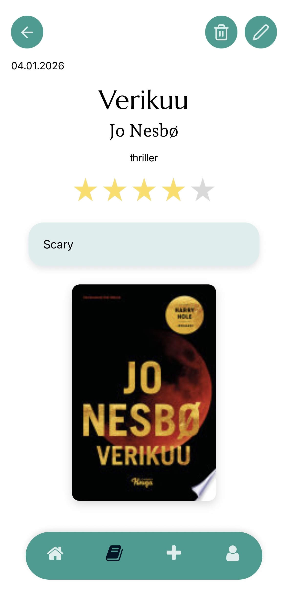
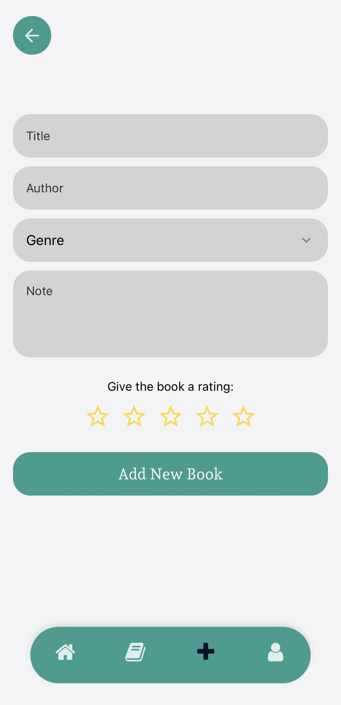
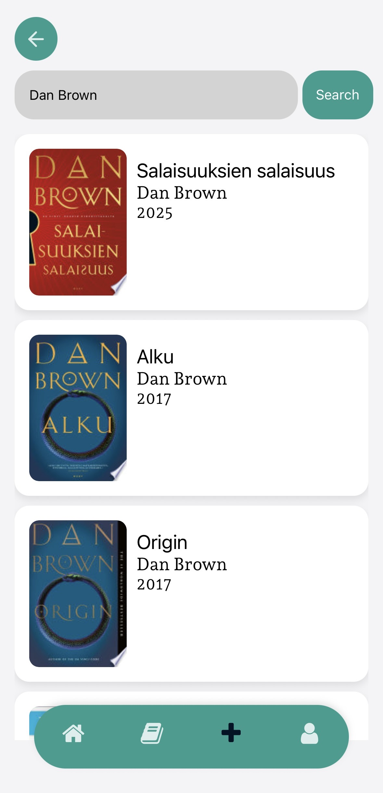
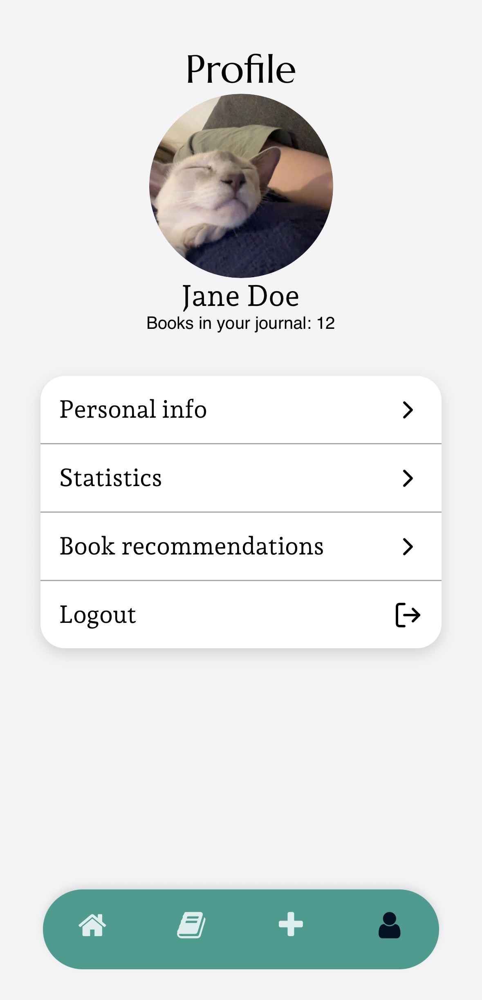
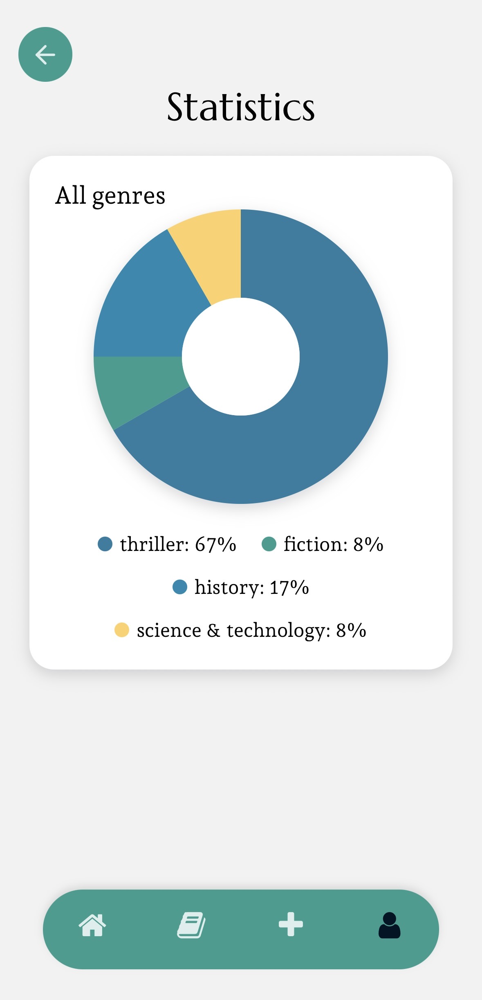
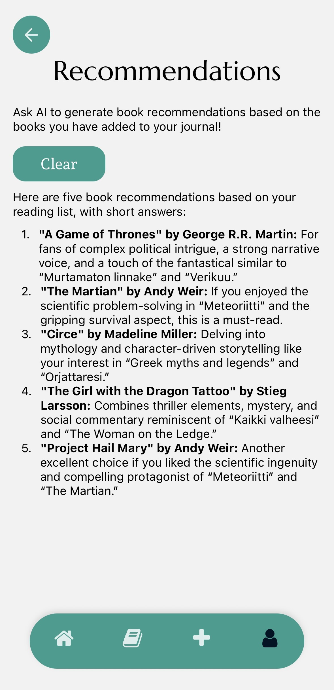

# BookJournal

A React Native mobile app that helps users track the books they’ve read,
organize personal notes and ratings, view reading statistics, and discover
new books through curated and AI-powered recommendations.

**Note:** This is a personal, non-commercial project for practicing mobile
development skills. The app is not published on any app store.

## Overview

**BookJournal** was built to solve a simple but personal problem:

_Keeping track of the books you’ve read, what you thought about them, and what
you want to read next._

At its core, the app functions as a personal reading library, allowing users to:

- Log books they’ve read
- Add notes and ratings
- Track reading habits over time

On top of this foundation, the app introduces smart discovery features using
AI: reading recommendations based on personal library and a shared Book of the
Day.

## Features

### 📖 Personal Library (Core Feature)

- Add books you’ve read or are reading
- Store:
  - Title & author
  - Personal notes
  - Rating
  - Genre
  - Date added
- All data is saved to a Firestore database
- Edit and delete books you have added to your library

### 📊 Reading Statistics

- View statistics based on your library
- Genre distribution
- Reading trends over time
- Helps users understand their reading preferences

### 🔍 Book Search & Manual Entry

- Add books manually
- Search books using the Google Books API
- Automatically fetch:
  - Cover images
  - Title & author metadata

### 🤖 AI-Powered Recommendations (Optional)

- Ask AI for personalized book recommendations
- Designed as a discovery tool — not a requirement
- AI responses are parsed safely and integrated into the app flow

### 📅 Book of the Day

- A single daily recommendation shared across users
- Cached locally to ensure:
  - One recommendation per day
  - No repeated requests
  - Acts as a lightweight discovery feature, separate from the personal
    library and recommendations

### 👤 Profile settings

- User information is saved in profile settings
- User can modify their personal information (name and email account) and
  add a profile picture

## Screenshots

<p float="left">
  
  
  
  
  
  
  
  
  
  
</p>

## Design & Assets

The app’s logo and selected UI elements (icons and buttons) were created using
licensed Canva design assets. All Canva elements are used in accordance with
Canva’s licensing terms.

## Tech Stack

- React Native
- Expo
- TypeScript
- Firebase Firestore database
- Google Books API
- AI integration (Gemini / LLM)
- Cloudflare Worker
- AsyncStorage

## Installation & Setup

### Prerequisites

- Node.js
- Expo CLI

```
git clone https://github.com/kaisahakola/book-journal
cd book-journal
npm install
npx expo start
```

## Known Limitations

- Not published on App Store or Google Play (developer fees)
- AI recommendations depend on network availability

## Future Improvements

- Add more statistics
- Improve adding a new book feature

## Project Goals & Learning Outcomes

This project was built to deepen practical experience with:

- Building scalable React Native apps using hooks and custom logic
- Managing asynchronous data flows (AI responses, API calls)
- Integrating third-party APIs safely and reliably
- Working with cloud databases and local caching strategies

BookJournal emphasizes real-world app architecture over demo-only features.

## Author

Kaisa Hakola

- GitHub: https://github.com/kaisahakola
- LinkedIn: https://www.linkedin.com/in/khakola/
